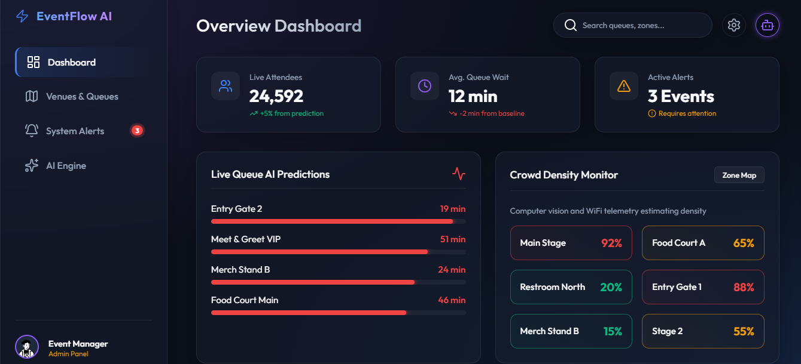
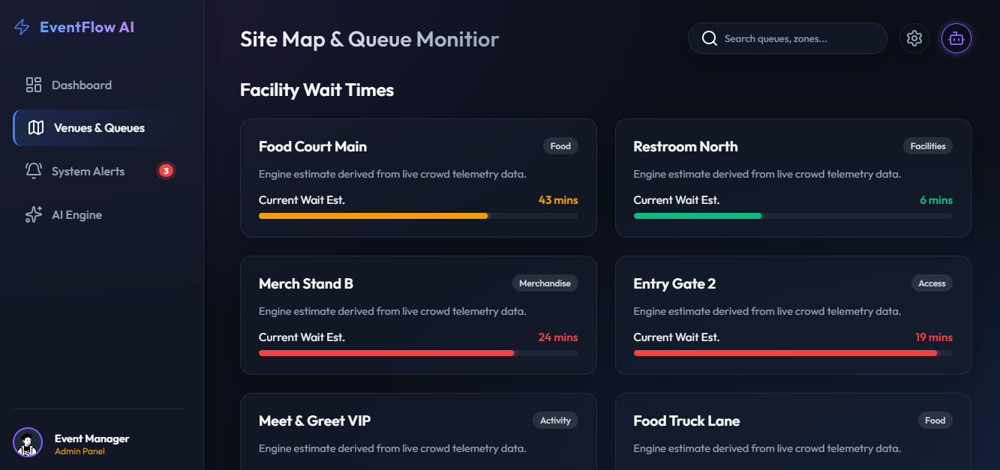
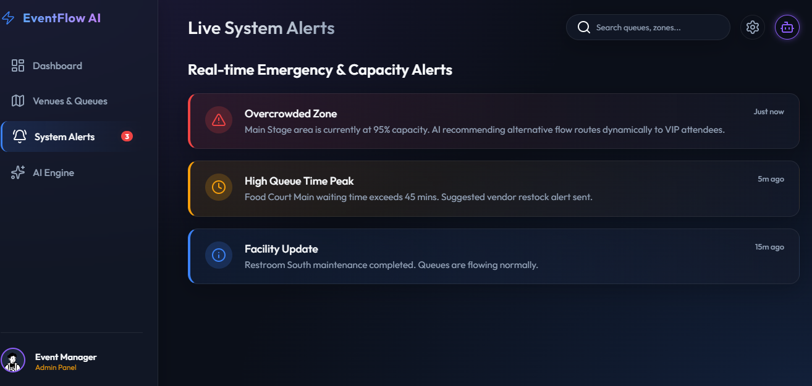
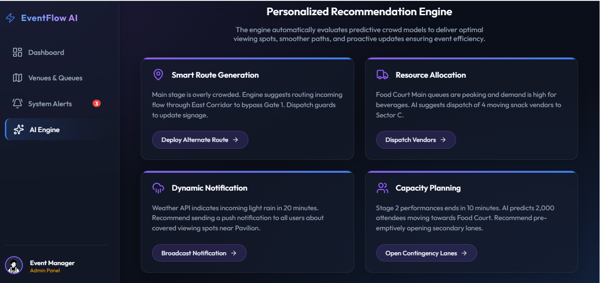
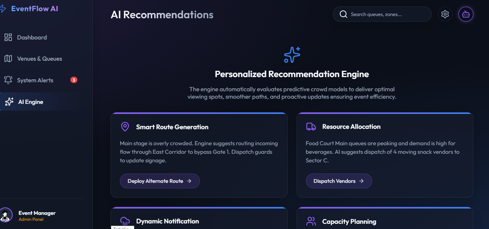

# promptwars-EventFlow-AI
EventFlow AI is an intelligent system that I designed and developed to enhance the experience of attendees at large-scale sporting events. It focuses on solving key challenges such as overcrowding, long waiting times, and lack of real-time coordination within stadiums and event venues.
## Screenshots of working model
### Dashboard

### Queue Time Prediction

### Real-Time Alerts

###  AI Experience Engine

### Preview

